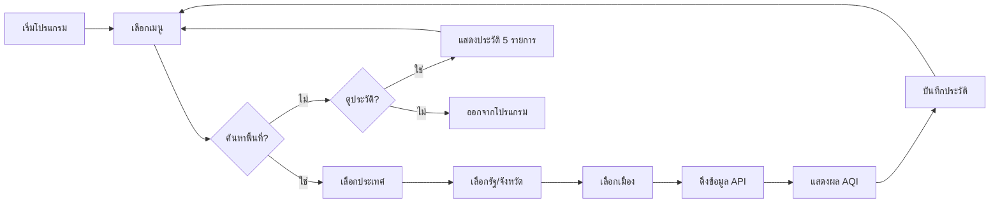

<div align="center">

# 🌬️ Python PM2.5 AQI Monitor

### ระบบตรวจสอบคุณภาพอากาศแบบเรียลไทม์ผ่าน Terminal

[](https://www.python.org/)
[](LICENSE)
[](https://www.iqair.com/)

[Features](#-ฟีเจอร์) • [Installation](#️-การติดตั้ง) • [Usage](#️-การใช้งาน) • [Demo](#-ตัวอย่างการใช้งาน) • [License](#-license)

</div>

---

## 📖 เกี่ยวกับโครงการ

โครงการ **Python PM2.5 AQI Monitor** เป็นเครื่องมือตรวจสอบคุณภาพอากาศแบบเรียลไทม์ที่พัฒนาด้วย Python สำหรับการศึกษาและติดตามค่า AQI (Air Quality Index) และ PM2.5 ผ่าน Command Line Interface (CLI)

ระบบจะดึงข้อมูลจาก **AirVisual API (IQAir)** และแสดงผลแบบกราฟิกสวยงามพร้อมคำแนะนำด้านสุขภาพตามมาตรฐานสากล

<br>

## ✨ ฟีเจอร์

<table>
<tr>
<td width="50%">

### 🎯 ฟีเจอร์หลัก
- 🌍 ค้นหาข้อมูลคุณภาพอากาศทั่วโลก
- 📊 แสดงค่า AQI (US Standard)
- 🌡️ แสดงข้อมูลอุณหภูมิและความชื้น
- 🎨 UI สวยงามด้วยสีสันใน Terminal
- ⚡ ข้อมูลแบบเรียลไทม์

</td>
<td width="50%">

### 💾 ฟีเจอร์เพิ่มเติม
- 🕒 บันทึกประวัติการค้นหา 5 รายการล่าสุด
- 🔁 ป้องกันข้อมูลซ้ำในประวัติ
- 📁 บันทึกลงไฟล์ JSON อัตโนมัติ
- 🔐 จัดการ API Key อย่างปลอดภัย
- 💡 คำแนะนำด้านสุขภาพตามระดับ AQI

</td>
</tr>
</table>

<br>

## 🎨 ระดับคุณภาพอากาศ (AQI)

<div align="center">

| AQI Range | ระดับ | สี | คำแนะนำ |
|:---------:|:------|:--:|:--------|
| 0-50 | 🟢 **ดีมาก** (Good) | 🟢 | เหมาะสำหรับกิจกรรมกลางแจ้ง |
| 51-100 | 🟡 **ปานกลาง** (Moderate) | 🟡 | กลุ่มเสี่ยงควรระวัง |
| 101-150 | 🟠 **เริ่มมีผลกระทบ** | 🟠 | ควรสวมหน้ากาก |
| 151-200 | 🔴 **ไม่ดีต่อสุขภาพ** | 🔴 | ลดกิจกรรมกลางแจ้ง |
| 201-300 | 🟣 **อันตรายมาก** | 🟣 | หลีกเลี่ยงการออกนอกบ้าน |
| 301+ | 🟤 **อันตรายร้ายแรง** | 🟤 | อยู่ในที่ร่ม |

</div>

<br>

## 🖥️ ตัวอย่างการใช้งาน

### หน้าจอเมนูหลัก
```
╔═══════════════════════════════════════════════════════╗
║                🌬️  AQI & PM 2.5 MONITORING SYSTEM               ║
╚═══════════════════════════════════════════════════════╝

📋 เมนูหลัก:
  [1] 🔍 ค้นหาตามพื้นที่
  [2] 🕒 ประวัติการค้นหาล่าสุด
  [3] 🚪 ออกจากโปรแกรม

กรุณาเลือก: _
```

### ตัวอย่างผลลัพธ์
```
╔═══════════════════════════════════════════════════════╗
║                       🌏 ข้อมูลคุณภาพอากาศ                        ║
╚═══════════════════════════════════════════════════════╝

📍 ตำแหน่ง: Bangkok, Bangkok (Thailand)
🕐 เวลา: 2026-02-13 14:30:00 ICT

🌡️  อุณหภูมิ: 32°C
💧 ความชื้น: 70%

😷 ค่า AQI (US Standard): 145
📊 ระดับคุณภาพอากาศ: 🟠 เริ่มมีผลกระทบ

💡 คำแนะนำด้านสุขภาพ:
   • กลุ่มเสี่ยง: หลีกเลี่ยงกิจกรรมกลางแจ้งที่หนักหน่วง
   • ประชาชนทั่วไป: ควรสวมหน้ากากเมื่อออกนอกอาคาร
   • เด็กและผู้สูงอายุ: ลดการอยู่กลางแจ้ง

═══════════════════════════════════════════════════════
```

<br>

## 🛠️ การติดตั้ง

### 📋 ความต้องการของระบบ

- Python 3.8 หรือสูงกว่า
- pip (Python package installer)
- บัญชี AirVisual API (ฟรี)

### 1️⃣ ดาวน์โหลดโปรเจค

```bash
# Clone repository
git clone https://github.com/yourusername/Python_PM2.5.git
cd Python_PM2.5
```

หรือ [ดาวน์โหลด ZIP](https://github.com/yourusername/Python_PM2.5/archive/refs/heads/main.zip) แล้วแตกไฟล์

### 2️⃣ ติดตั้ง Dependencies

```bash
# ติดตั้งจาก requirements.txt
pip install -r requirements.txt

# หรือติดตั้งแยก
pip install requests colorama python-dotenv
```

### 3️⃣ ตั้งค่า API Key

**วิธีสร้าง API Key:**

1. สมัครสมาชิกที่ [IQAir Dashboard](https://dashboard.iqair.com/personal/api-keys)
2. สร้าง API Key (ฟรี)
3. Copy API Key

**สร้างไฟล์ `.env`:**

```bash
# สร้างไฟล์ .env ในโฟลเดอร์โปรเจค
touch .env
```

**เพิ่ม API Key ลงในไฟล์:**

```env
AIRVISUAL_API_KEY=your_api_key_here
```

> ⚠️ **คำเตือน:** อย่าแชร์ไฟล์ `.env` หรือ commit ขึ้น Git!

<br>

## ▶️ การใช้งาน

### เริ่มต้นโปรแกรม

```bash
python main.py
```

### การใช้งานผ่านเมนู

**1. ค้นหาตามพื้นที่** 🔍
- เลือกประเทศ → จังหวัด/รัฐ → เมือง
- แสดงผลข้อมูล AQI พร้อมคำแนะนำ

**2. ดูประวัติการค้นหา** 🕒
- แสดง 5 รายการล่าสุด
- ข้อมูลจัดเรียงตามเวลา

**3. ออกจากโปรแกรม** 🚪
- บันทึกข้อมูลอัตโนมัติ

<br>

## 📂 โครงสร้างโปรเจค

```
Python_PM2.5/
│
├── 📄 main.py              # ไฟล์หลักของโปรแกรม
├── 🔐 .env                 # API Key (ไม่ควร commit)
├── 📊 aqi_history.json     # ไฟล์บันทึกประวัติ
├── 📋 requirements.txt     # รายการ dependencies
├── 📖 README.md            # เอกสารคู่มือ
└── 📜 LICENSE              # ลิขสิทธิ์โครงการ
```

<br>

## 🔧 เทคโนโลยีที่ใช้

<div align="center">

| เทคโนโลยี | การใช้งาน | เวอร์ชัน |
|:---------:|:----------|:--------:|
|  | ภาษาหลัก | 3.8+ |
|  | HTTP API Calls | Latest |
|  | สีสันใน CLI | Latest |
|  | จัดการ ENV | Latest |

</div>

<br>

## 🌟 ตัวอย่างการทำงาน

### Workflow


<br>

## 📚 แหล่งข้อมูลเพิ่มเติม

- 🌐 [IQAir API Documentation](https://www.iqair.com/air-pollution-data-api)
- 📊 [EPA AQI Guide](https://www.airnow.gov/aqi/aqi-basics/)
- 🏥 [WHO Air Quality Guidelines](https://www.who.int/news-room/fact-sheets/detail/ambient-(outdoor)-air-quality-and-health)
- 🇹🇭 [กรมควบคุมมลพิษ](http://air4thai.pcd.go.th/)

<br>

## 🤝 การมีส่วนร่วม

เรายินดีรับการมีส่วนร่วมจากทุกคน! 

1. Fork โปรเจค
2. สร้าง Feature Branch (`git checkout -b feature/AmazingFeature`)
3. Commit การเปลี่ยนแปลง (`git commit -m 'Add some AmazingFeature'`)
4. Push ไป Branch (`git push origin feature/AmazingFeature`)
5. เปิด Pull Request

<br>

## 🐛 รายงานปัญหา

พบข้อผิดพลาดหรือมีข้อเสนอแนะ? 
- [เปิด Issue](https://github.com/yourusername/Python_PM2.5/issues)
- หรือติดต่อโดยตรงผ่าน Email

<br>

## 👨‍💻 ผู้พัฒนา

<div align="center">

**Nick Kissy**

[](mailto:nick01.nick02.nick03@gmail.com)
[](https://github.com/yourusername)

</div>

<br>

## 📄 License

This project is licensed under the MIT License - see the [LICENSE](LICENSE) file for details.

```
MIT License

Copyright (c) 2026 Nick Kissy

Permission is hereby granted, free of charge, to any person obtaining a copy
of this software and associated documentation files...
```

<br>

## 🙏 กิตติกรรมประกาศ

- **IQAir** - สำหรับ AirVisual API
- **Python Community** - สำหรับเครื่องมือและไลบรารีที่ยอดเยี่ยม
- **Open Source Contributors** - ทุกคนที่มีส่วนร่วม

<br>

---

<div align="center">

**หากโปรเจคนี้มีประโยชน์ อย่าลืมกด ⭐ Star ให้กำลังใจด้วยนะครับ!**

Made with ❤️ in Thailand

</div>

